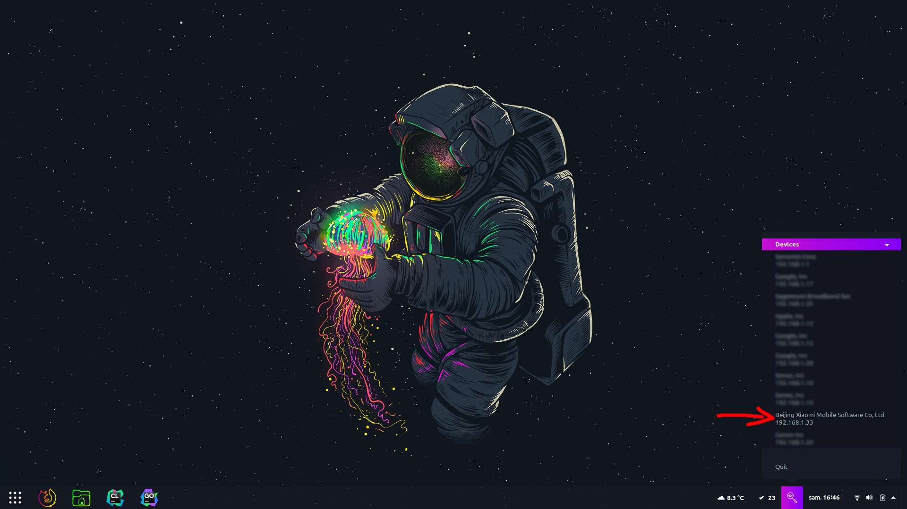

# Airbnb camera scanner

Python app that scan for cameras.

## Screenshots



Note: Show you device's company name but doesn't warn you yet about possible recording devices.

Here : Mi Home Security Camera 360° 1080P by Xiaomi.

## Dev

### With Virtualenv (Recommended)

Call it `venv` really important!

#### Linux

```
$ virtualenv venv -p $(which python3.9) --always-copy
$ source venv/bin/activate
```

You will also need to give special permission to use scapy newtorks feature.
```
$ setcap cap_net_raw=eip venv/bin/python
```

And install python dependecies.
```
$ pip install --upgrade pip
$ pip install -r requirements.txt
```

#### Windows

```
$ virtualenv venv
$ .\venv\Script\activate
```

For windows you will need Npcap : https://nmap.org/npcap/

And install python dependecies.
```
$ pip install --upgrade pip
$ pip install -r requirements.txt
```

## Build

### Windows

Windows use (PyInstaller)[http://www.pyinstaller.org/] to build the Airbnb Camera Scanner.
```
$ pip install pyinstaller
```

Build command:
```
$ pyinstaller airbnb-scanner.spec
```

The working executable is in the `dist` folder and called `AirbnbScanner.exe`.

You can now create an installer for Windows.
You will need to install NSIS software : https://nsis.sourceforge.io/Download
In your favorite PowerShell terminal :
```
$ $tag = "v0.0.0"
$ $size = [math]::floor((Get-ChildItem dist\ -Recurse | Measure-Object -Sum Length | Select-Object -ExpandProperty Sum)/1000)
$ $major, $minor, $build = $tag.substring(1).split(".")
$ & 'C:\Program Files (x86)\NSIS\Bin\makensis.exe' /DTAG=$tag /DSIZE=$size /DMAJOR=$major /DMINOR=$minor /DBUILD=$build zeronetbrowser.nsi
```

### Linux

!!!Important!!!
We stick pyqtdeploy 2.5.1 and wil upgrade to 3.1 later. Still having some issue.

Linux use (PyQtDeploy)[https://www.riverbankcomputing.com/static/Docs/pyqtdeploy/] to build the Airbnb Camera Scanner.

```
$ pip install pyqtdeploy==2.5.1
$ make patches
```
This version need to be patches to succefully build the project.

Download the sources files to be compiled.
```
$ make download
```

Create sysroot folder.
```
$ make init
```

Build.
```
$ make build
```

## Notes

### Scapy root privileges needed

https://stackoverflow.com/questions/20763039/creating-raw-socket-in-python-without-root-privileges

https://stackoverflow.com/questions/36215201/python-scapy-sniff-without-root

```
$ setcap cap_net_raw=eip venv/bin/python
```

But also we need `$XDG_RUNTIME_DIR` to match the user folder so no root to see the tray icon.

----

### Packaging with pyqtdeploy

You will probably need all this dependencies (https://doc.qt.io/qt-5/linux-requirements.html).

Error :
```
_ctypes.c:107:10: fatal error: ffi.h: No such file or directory
```
Answer :
```
sudo apt install libffi-dev
```

----

### Release

It takes too long to build in CI. Instead builds are being done locally on my computer (maybe for the best).
```
make build
```

Using semver standard.

----

### Linux libcrypto

Requires `libssl1.1` for the latest version.

----

### `pip install` error 

Error
```
AttributeError: module 'sipbuild.api' has no attribute 'prepare_metadata_for_build_wheel'
```

Solution: update pip to version 22 `pip install --upgrade pip`


### [Windows] Install npcap

Error:
```
RuntimeError: Sniffing and sending packets is not available at layer 2: winpcap is not installed. You may use conf.L3socket orconf.L3socket6 to access layer 3
```

https://nmap.org/npcap/


### Acknowledgment

Reload icon by [Gregor Cresnar](https://www.flaticon.com/authors/gregor-cresnar).
Warning icon by [Kit of Parts](http://kitofparts.co/).
B. for testing Windows build.